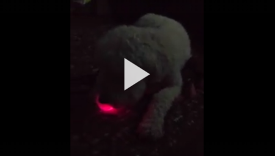
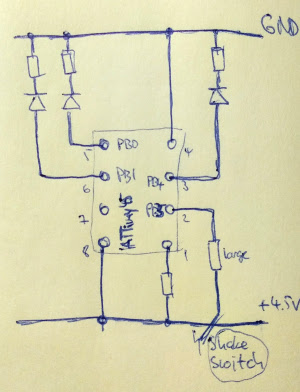
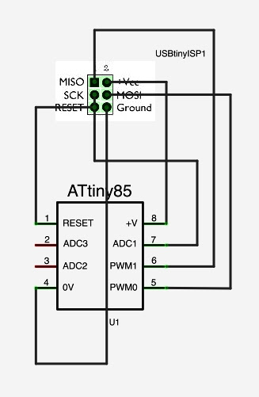
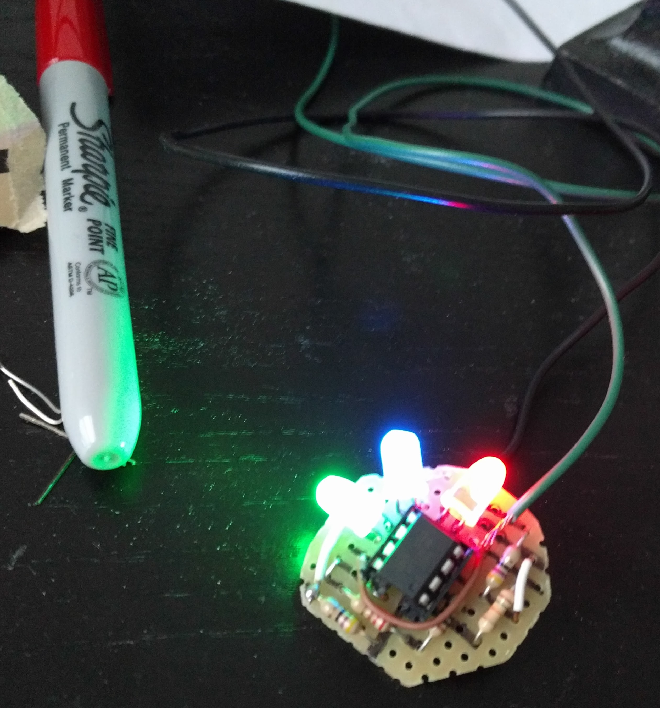

# New ball for Cooper!

Cooper's glow-in-the-dark ball broke. It's hard to play fetch at night without one! The rubber ball was fine, so I made a new blinky to go inside: an attiny45 microcontroller driving three LEDs, doing some color effects. One of them spells C-o-o-p-e-r in morse code.

.

.

The circuit is as shown below, where "shake switch" is just a loose wire basically. As the ball bounces around, it will open and close pretty randomly. But on the shelf at home, it will stay open or closed as it is. That's how we'll turn the ball on. (The ATtiny is programmed  to do its thing for a few minutes, then turn off the LEDs and enter sleep mode. An input pin voltage change will wake it up again, via pin change interrupt.)

All code is in [cooper.c](cooper.c). See comment at end for compiling and linking with gcc. I uploaded to the ATTiny using avrdude and a USBTiny programmer hooked up as shown:

Getting there! Got a [printed circuit board](IMG_20161202_174834.jpg) and got everything soldered up and blinking:

